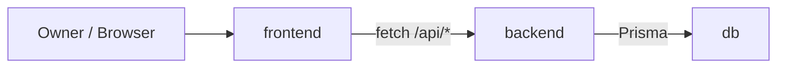

# Architecture — Snippet Stash

Living document. Обновляется агентами после имплементации новых модулей/сервисов.

## Сервисы

| Сервис | Роль |
|---|---|
| `db` (postgres:16-alpine) | Хранение Snippet/Tag/SnippetTag. Volume `db-data`. Healthcheck `pg_isready`. |
| `backend` (NestJS) | REST API под `/api`. Аутентификация по `X-API-Key`. Prisma миграции при старте. |
| `frontend` (Next.js App Router) | UI. Server Components + server actions. Кладёт API-key в httpOnly cookie `sk_session`. |

## Зависимости



## Контракт API (план)

| Endpoint | Метод | Описание |
|---|---|---|
| `/api/health` | GET | Liveness `{ status: "ok" }` |
| `/api/snippets` | GET | Список (filters: `q`, `tag`, `page`) |
| `/api/snippets` | POST | Создать |
| `/api/snippets/:id` | GET | Один |
| `/api/snippets/:id` | PATCH | Обновить |
| `/api/snippets/:id` | DELETE | Удалить |
| `/api/tags` | GET | Список тегов с counts |

Все защищённые endpoint'ы требуют `X-API-Key`. `/api/health` — публичный.

## Данные

```
Snippet (id, title, language, content, createdAt, updatedAt)
Tag (id, name UNIQUE lowercase)
SnippetTag (snippetId, tagId)  -- M:N
```

## Аутентификация

- `BACKEND_API_KEY` — секрет в env backend, генерируется вручную (длинная случайная строка)
- Frontend `/login` принимает ключ, сохраняет в httpOnly cookie `sk_session`
- Frontend server-side fetch к backend добавляет ключ из cookie в заголовок `X-API-Key`

## Развёртывание

- Локально: `docker compose up --build`
- Production: docker-dokploy (в учебном прогоне НЕ выполняется; артефакты должны быть готовы)

## Living document — что обновлять

После завершения молекулы:
- Если добавлен/удалён сервис → таблица «Сервисы» и mermaid
- Если изменён публичный контракт API → таблица «Контракт API»
- Если изменена структура хранения → блок «Данные»
- Если изменилась модель аутентификации → блок «Аутентификация»

Молекулы которые **не** затрагивают перечисленное выше — ARCHITECTURE.md не трогают.
