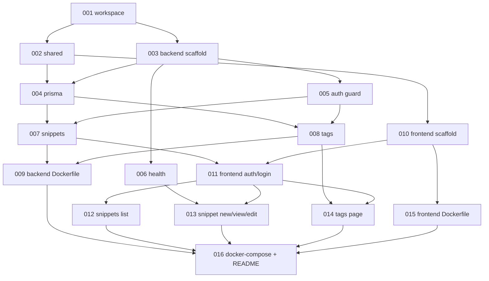

# Project Plan — Snippet Stash

Автогенерация из `.claude/state/plan.json`. **Не редактируй вручную** — правки потеряются. Меняй `plan.json` напрямую, потом перегенерируй этот файл.

## Прогресс
- Всего задач: 16
- Выполнено: 0 / 16
- Бюджет: $0 / $50 (hard cap)
- Текущий фокус: `task-001`

## Фазы

### Phase: foundation (workspace + shared)
- [ ] **task-001** — Инициализировать pnpm workspace монорепо с Turborepo, корневыми tsconfig/eslint/prettier (`devops-engineer`, `infra`, ~18k tok)
- [ ] **task-002** — Создать пакет `@snippet-stash/shared` с Zod-схемами и DTO для Snippet/Tag (`backend-implementer`, `shared`, ~12k tok)

### Phase: backend (NestJS service)
- [ ] **task-003** — Скаффолд NestJS приложения backend с глобальным префиксом `/api`, ValidationPipe и ConfigModule с Zod-валидацией env (`backend-implementer`, ~18k tok)
- [ ] **task-004** — Определить Prisma schema (Snippet, Tag, SnippetTag), создать initial migration и PrismaService модуль (`backend-implementer`, ~15k tok)
- [ ] **task-005** — Реализовать AuthModule с ApiKeyGuard, читающим `X-API-Key` и сверяющим с `BACKEND_API_KEY` (`backend-implementer`, ~14k tok)
- [ ] **task-006** — Реализовать публичный HealthModule с `GET /api/health` возвращающим `{status:"ok"}` (`backend-implementer`, ~10k tok)
- [ ] **task-007** — Реализовать SnippetsModule: CRUD контроллер, сервис, DTO, фильтрация по `q`/`tag`/`page`, тесты счастливых путей + 401 (`backend-implementer`, ~24k tok)
- [ ] **task-008** — Реализовать TagsModule: `GET /api/tags` со списком тегов и counts сниппетов, тесты + 401 (`backend-implementer`, ~14k tok)
- [ ] **task-009** — Создать multi-stage Dockerfile для backend с pnpm, `prisma generate` и `migrate deploy` на старте (`devops-engineer`, ~13k tok)

### Phase: frontend (Next.js app)
- [ ] **task-010** — Скаффолд Next.js 15 App Router приложения с Tailwind 4, shadcn/ui примитивами и базовым layout (`frontend-implementer`, ~22k tok)
- [ ] **task-011** — API-клиент к backend, middleware редиректа на `/login`, страница `/login` с server action для cookie `sk_session` (`frontend-implementer`, ~18k tok)
- [ ] **task-012** — Страница `/snippets` со списком, поиском по подстроке и фильтром по одному тегу (`frontend-implementer`, ~16k tok)
- [ ] **task-013** — Страницы `/snippets/new` и `/snippets/[id]` (просмотр с highlight.js, edit/delete через server actions) (`frontend-implementer`, ~22k tok)
- [ ] **task-014** — Страница `/tags` со списком тегов и счётчиком, клик → `/snippets?tag=...` (`frontend-implementer`, ~11k tok)
- [ ] **task-015** — Multi-stage Dockerfile для frontend (Next.js standalone output) (`devops-engineer`, ~12k tok)

### Phase: infra (docker-compose + readme)
- [ ] **task-016** — Корневой `docker-compose.yml` (db/backend/frontend с healthchecks и volume), финальный `README.md` с инструкциями `docker compose up` (`devops-engineer`, ~14k tok)

## Сводка по ролям

| Роль | Задач | Сумма tokens |
|---|---|---|
| backend-implementer | 7 (002-008) | ~107k |
| frontend-implementer | 5 (010-014) | ~89k |
| devops-engineer | 4 (001, 009, 015, 016) | ~57k |

Итого estimated: ~253k токенов. Резерв на validator/review/fix-loop добавит ещё ~30-50%.

## Граф зависимостей

## Deferred / not in plan
- e2e frontend тесты — не делаем для MVP
- GitHub Actions CI — не делаем (см. `technical_solutions.md`)
- Реальный деплой на Dokploy — артефакты готовим dokploy-совместимыми, но `dokploy.yaml` и фактический push не выполняются
- Multi-user, OAuth, sharing, версионирование — out of scope MVP
